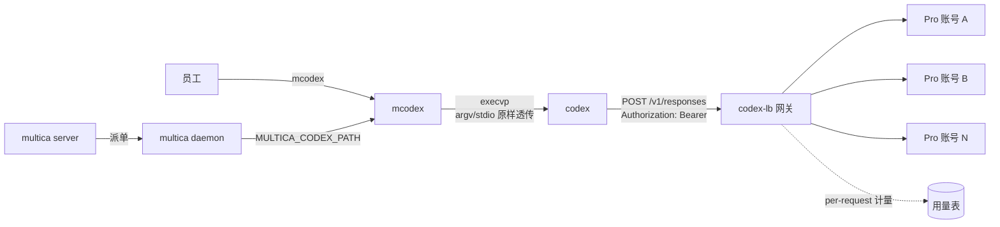
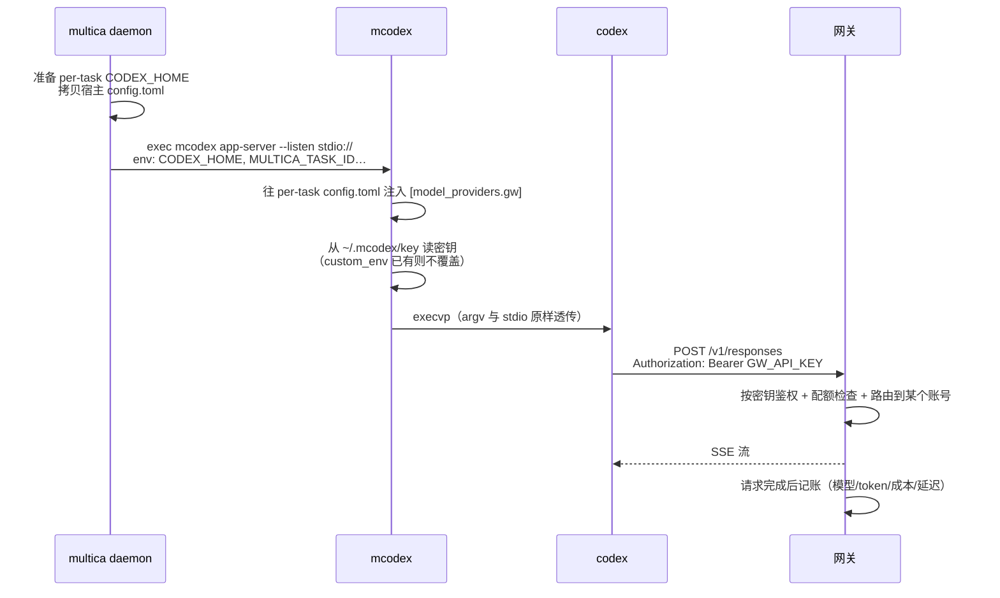

# corp-codex-pool

把多个 Codex 订阅变成一个内部号池，按人发密钥、按人计量，并让 [multica](https://github.com/multica-ai/multica) 拉起的 codex 自动走这个号池。

**不改 multica 一行代码，不改 codex 一行代码，也不碰你自己的 `codex`。**

```
codex   →  provider: openai  →  你的个人订阅
mcodex  →  provider: gw      →  公司号池网关  →  Pro 账号 A / B / N
```

同一台机器、同一个模型，走不同上游，互不干扰。

---

## 目录

- [解决什么问题](#解决什么问题)
- [工作原理](#工作原理)
- [安装](#安装)
- [快速开始](#快速开始)
- [命令参考](#命令参考)
- [配置项](#配置项)
- [两种接入方式](#两种接入方式)
- [密钥管理](#密钥管理)
- [用量与计量](#用量与计量)
- [故障排查](#故障排查)
- [已知限制](#已知限制)
- [实测数据](#实测数据)
- [设计取舍](#设计取舍)
- [开发](#开发)
- [FAQ](#faq)

---

## 解决什么问题

企业买了多个 Codex 订阅想分给工程师用，会遇到三个问题：

1. **不能直接分发账号。** 账号凭据散落到每台机器上，人一走就要改密码，用量也无从归集。
2. **号池网关知道花了多少，但不知道是谁花的。** 网关只看得见 API 密钥。
3. **multica 知道人、任务、工作区，但它不做 LLM 代理。** 它的路由代码里写得很明白，暴露一个通用 LLM 代理会让任何登录用户拿部署方的密钥跑任意补全。

于是两边各跑各的：**网关有量无人，multica 有人无量**。

这个工具把两边接上：

| 能力 | 只有网关 | 只有 multica | 接上之后 |
|---|---|---|---|
| 多个订阅共享 | 有 | 无 | 有 |
| 按人计量 | 做不到（只看得见密钥） | 无请求级用量 | 密钥即人，可归集 |
| 超额硬拦截 | 可做 | 物理上做不到<sup>1</sup> | 网关拦截 |
| 员工无需登录 | — | — | 密钥由服务端下发 |
| 离职即时回收 | — | — | 吊销密钥，0.06 秒生效 |

<sup>1</sup> multica 的用量只在任务结束后上报一次，跑到一半发现超额没法掐断。

### 适用场景

- 团队有多个 Codex 订阅要共享，需要知道每个人用了多少
- 用 multica 做多 agent 编排，希望 agent 跑的 codex 统一走公司额度
- 需要按人设额度上限、模型白名单、有效期
- 人员流动时要能立即回收访问权

### 不适用

- 只有一个人用 —— 直接用 codex 就好
- 需要精确到"每个任务花了多少" —— 见[已知限制](#已知限制)
- 想绕过订阅条款做转售 —— 本项目是给企业内部分发自购订阅用的

---

## 工作原理

`mcodex` 是个薄封装：准备好环境后用 `execvp` 交棒给真 codex，argv 与 stdio 原样透传。



它覆盖两种运行场景：

**你直接敲 `mcodex`** — 环境里没有 `CODEX_HOME`，就设成 `~/.mcodex`（那里有号池 provider 配置和密钥），然后 exec codex。

**multica daemon 拉起** — daemon 会把 `CODEX_HOME` 指向 per-task 目录，并从 `~/.codex/config.toml` 拷一份配置进去。既然宿主那份不含号池 provider，`mcodex` 就在 exec 前把 provider 注入这份 per-task 配置。daemon 准备完就不再动它，所以这个时机是安全的，且每个任务都是新目录。

### 依赖的三个上游机制

全是 codex 与 multica 本来就有的行为，没有一处 hack：

| 机制 | 作用 |
|---|---|
| codex 自定义 provider 的 `env_key` 从环境变量读密钥，且**优先于 `auth.json`** | 每人一把密钥，不用分发账号；有 `env_key` 时**不需要 `codex login`** |
| multica daemon 支持 `MULTICA_CODEX_PATH` 指定 codex 可执行文件 | 不改 multica 就能换成 `mcodex` |
| multica 的 `custom_env` 会被 daemon 铺到 codex 子进程环境，且不拦自定义变量名 | 密钥可按人下发到各自的 agent |

### 密钥注入时序



---

## 安装

需要 **Python 3.11+**（用到标准库 `tomllib`）。

```bash
git clone https://github.com/david1996yong-design/corp-codex-pool.git
cd corp-codex-pool
pip install -e .
```

装完会有两个命令：

- `poolctl` —— 管理端（签发密钥、看用量、体检）
- `mcodex` —— 员工端（走号池的 codex）

### 前置条件

| 组件 | 要求 |
|---|---|
| [codex CLI](https://github.com/openai/codex) | 已安装。`mcodex` 会 exec 它 |
| 号池网关 | 必须实现 **Responses API**（`POST /v1/responses`）。本项目针对 [codex-lb](https://github.com/Soju06/codex-lb) 开发与验证 |
| multica | 可选。只在需要让 multica agent 走号池时用 |

> ⚠️ **网关必须支持 Responses API。** codex 已经移除了 `wire_api = "chat"`，只接受 `"responses"`。只做 chat/completions 兼容的网关**接不上**。

---

## 快速开始

### 管理员：签发密钥

```bash
cp .env.example .env      # 填写网关地址与管理面密码
poolctl status            # 确认能连上网关

poolctl issue zhangsan --weekly-token-limit 20000000
```

密钥明文**只在签发时显示一次**，之后只能看到前缀。记下来发给员工。

### 员工：本机初始化

```bash
poolctl mcodex init --key-stdin
# 粘贴密钥，回车，Ctrl-D
```

之后把 `codex` 换成 `mcodex`：

```bash
mcodex
mcodex exec "重构这个模块"
```

`mcodex init` 默认从 `~/.codex/config.toml` 继承使用偏好（模型、推理强度、已信任目录），手感和平时一致。**只继承偏好，不复制任何凭据。**

### 让 multica 走号池

```bash
poolctl daemon restart    # 带上 MULTICA_CODEX_PATH 启动
poolctl daemon status     # 确认它用的确实是 mcodex
```

输出应包含：

```
✓ daemon 使用的 codex：/…/mcodex（走号池）
```

### 验证

```bash
poolctl doctor --key sk-clb-...
```

13+ 项检查，覆盖网关连通性、配置正确性、密钥有效性、超限契约。每个失败项都带可执行的下一步。

---

## 命令参考

### `poolctl issue` — 签发密钥

```bash
poolctl issue <员工标识> [选项]
```

密钥名会是 `pool-<员工标识>`，建议用工号或邮箱前缀。

| 选项 | 说明 |
|---|---|
| `--agent-id <uuid>` | 同时下发到该 multica agent 的 `custom_env` |
| `--workspace-id <uuid>` | multica workspace，默认取本机 CLI 配置 |
| `--weekly-token-limit <n>` | 周令牌上限，超出返回 429 |
| `--allowed-model <name>` | 模型白名单，可重复。⚠️ 见下方警告 |
| `--expires-days <n>` | 有效期天数 |
| `--traffic-class <foreground\|opportunistic>` | 流量等级。`opportunistic` 只在池内有余量时才被接纳 |
| `--no-reuse` | 同名密钥已存在时报错而非复用 |
| `--dry-run` | 只显示将要做什么 |

> ⚠️ **模型白名单会放大重试。** 命中白名单外的模型时网关返回 403，而 codex 对 403 会**重试 6 次**。请求都被拦在网关、不消耗上游额度，但会放大网关负载。白名单务必覆盖员工日常使用的模型。

### `poolctl deliver` — 下发密钥到 agent

```bash
poolctl deliver --agent-id <uuid> --key <明文> [--dry-run]
```

把密钥写入指定 multica agent 的 `custom_env`。适合密钥已签发、事后补下发的情况。

### `poolctl revoke` — 吊销

```bash
poolctl revoke <员工标识> [--agent-id <uuid>] [--yes]
```

网关侧**立即生效**（实测 0.06 秒）。带 `--agent-id` 会同时清除该 agent 的 `custom_env`。

### `poolctl usage` — 用量

```bash
poolctl usage [--since ISO8601] [--until ISO8601] [--by-session] [--json]
```

默认按密钥归集：

```
密钥                       请求        输入        缓存   命中率   延迟中位     最慢    成本USD
--------------------------------------------------------------------------------------
pool-zhangsan                22   254,863   126,208    49.5%     3.5s     1.1m     0.6513
pool-lisi                    14    75,818         0     0.0%     6.1s     8.2s     0.0766
```

`--by-session` 按会话归集，看单次任务花了多少。

最慢请求超过 10 分钟时会自动告警 —— 那意味着 multica 的任务可能被误杀，详见[故障排查](#任务失败但网关显示成功)。

### `poolctl doctor` — 体检

```bash
poolctl doctor [--key <明文>] [--config <path>] [--json]
```

不带 `--key` 只做静态检查；带上则会真实发一次请求。检查项包括：

- 网关 Responses 端点是否存在、`/models` 是否实现
- 当前接入方式（mcodex / 宿主注入）与配置文件位置
- `wire_api` / `base_url` / `env_key` / 默认 provider / 对账请求头
- mcodex 家目录的密钥来源与固化的 codex 路径是否仍可用
- 密钥可用性、额度预警头、超限契约
- multica 连通性与 agent 密钥来源

### `poolctl status` — 概况

显示当前配置（凭据打码）与号池账号、密钥列表。

### `poolctl setup` / `unsetup` — 宿主注入方式

```bash
poolctl setup [--dry-run] [--no-default] [--no-headers] [--base-url URL]
poolctl unsetup [--dry-run]
```

把号池 provider 直接写进宿主 `~/.codex/config.toml`。**这会让你自己的 `codex` 也走号池**，除非确实想要整机切换，否则用 `mcodex`。详见[两种接入方式](#两种接入方式)。

幂等、自动备份，`unsetup` 可完整回滚。

### `poolctl mcodex init` — 初始化员工端

```bash
poolctl mcodex init [--key <明文> | --key-stdin] [--inherit/--no-inherit]
                    [--home <path>] [--real-codex <path>]
```

| 选项 | 说明 |
|---|---|
| `--key-stdin` | 从 stdin 读密钥，避免出现在 shell 历史与 `ps` |
| `--no-inherit` | 不从 `~/.codex/config.toml` 继承偏好 |
| `--real-codex` | 指定真 codex 绝对路径。不给则自动探测并固化 |
| `--home` | 自定义家目录，默认 `~/.mcodex` |

### `poolctl mcodex path` — 打印 mcodex 路径

用于配置 `MULTICA_CODEX_PATH`。

### `poolctl daemon` — 带号池配置管理 daemon

```bash
poolctl daemon start
poolctl daemon restart
poolctl daemon status
```

multica 只能通过 `MULTICA_CODEX_PATH` 环境变量指定 codex 路径（它的 `config.json` 只支持 `server_url` / `app_url` / `workspace_id` 三个键）。直接 `multica daemon start` 拿不到这个变量，daemon 会**悄悄退回系统 codex、绕开号池**。

> ⚠️ **别用 `multica daemon restart` 代替 `poolctl daemon restart`。** 前者由已在运行的 daemon 自己拉起新进程，会继承旧环境，新设的变量传不进去。`poolctl daemon restart` 是 stop 再 start。

---

## 配置项

配置优先级：**命令行参数 > 环境变量 > `.env` 文件 > 默认值**。

### 管理端（`.env`）

| 变量 | 默认 | 说明 |
|---|---|---|
| `POOL_ADMIN_URL` | `http://127.0.0.1:2455` | 网关管理面地址 |
| `POOL_ADMIN_PASSWORD` | — | 管理面密码。codex-lb 用 cookie session 登录 |
| `POOL_ADMIN_TOKEN` | — | 预留，当前管理面不接受 Bearer |
| `POOL_BASE_URL` | `http://127.0.0.1:2455/v1` | 员工侧 codex 访问的网关地址。**必须是 daemon 宿主机可达的地址**，全员铺开时换成内网域名 |
| `MULTICA_SERVER_URL` | `https://api.multica.ai` | 自托管填自己的地址 |
| `MULTICA_TOKEN` | — | 不填则读 `~/.multica/config.json` |
| `POOL_PROVIDER_ID` | `gw` | 出现在 `[model_providers.<id>]` |
| `POOL_ENV_KEY` | `GW_API_KEY` | codex 从此环境变量读密钥，须与注入的 `env_key` 一致 |

### 员工端（环境变量）

| 变量 | 说明 |
|---|---|
| `GW_API_KEY` | 号池密钥。优先于 `~/.mcodex/key` |
| `MCODEX_HOME` | 覆盖默认家目录 `~/.mcodex` |
| `MCODEX_REAL_CODEX` | 临时覆盖真 codex 路径，便于排障与灰度 |

### 注入到 codex 的配置长这样

```toml
# BEGIN corp-codex-pool (managed; do not edit by hand)
model_provider = "gw"

[model_providers.gw]
name = "Company Codex Pool"
base_url = "http://127.0.0.1:2455/v1"
wire_api = "responses"
env_key = "GW_API_KEY"
env_key_instructions = "由号池控制台下发，请勿手工设置"

[model_providers.gw.env_http_headers]
"X-Multica-Task-Id" = "MULTICA_TASK_ID"
"X-Multica-Agent-Id" = "MULTICA_AGENT_ID"
"X-Multica-Workspace-Id" = "MULTICA_WORKSPACE_ID"
# END corp-codex-pool
```

字段名逐字对应 codex 的 `ModelProviderInfo`，不要臆造。

---

## 两种接入方式

| | `mcodex`（推荐） | `poolctl setup` |
|---|---|---|
| 配置位置 | `~/.mcodex/config.toml` | `~/.codex/config.toml` |
| 影响你自己的 `codex` | **不影响** | 会一起走号池 |
| 未设密钥时 | 只有 `mcodex` 报错 | **`codex` 直接报错** |
| multica 接入 | 设 `MULTICA_CODEX_PATH` | 无需额外设置 |
| 命令 | `mcodex` | `codex` 照旧 |

`poolctl setup` 之后不设 `GW_API_KEY` 跑 `codex`，会看到：

```
ERROR failed to refresh available models: Missing environment variable: `GW_API_KEY`
```

除非确实想让整台机器都走号池，否则用 `mcodex`。

`poolctl doctor` 会自动识别当前用的是哪种，并在报告里标注。

---

## 密钥管理

### 两种粒度

| 方式 | 存放位置 | 适用 |
|---|---|---|
| 机器级 | `~/.mcodex/key`（权限 600） | 一台机器一个人，最简单 |
| per-agent | multica agent 的 `custom_env` | 一台机器多人 / 多档位 |

`custom_env` 优先于家目录密钥文件，两者可混用。`poolctl doctor` 会说明当前实际生效的是哪种。

### 生命周期

```
签发 (poolctl issue)
  → 明文只显示一次
  → 下发到员工机器 (mcodex init) 或 agent (deliver)
  → 使用中：网关按密钥记账
  → 吊销 (poolctl revoke)：0.06 秒生效
```

### 安全须知

- **密钥在员工机器上是明文存放的**（`~/.mcodex/key`，权限 600）。
- **走 `custom_env` 时对 agent 的 shell 可见** —— `custom_env` 里的键会进 codex 的 `shell_environment_policy.include_only`，agent 自己跑 `env` 能看到。
- 号池密钥只是入场券：泄露后果限于该员工额度，且可即时吊销。若安全评审不接受，需要改 multica 上游走 daemon 侧 `agentEnv`（含 `KEY` 的变量会被排除出 `include_only`，但 codex 主进程仍拿得到）。
- **号池 agent 一律设为 private。** multica 的 `agent_runtime.visibility` 若为 `public`，工作区任何成员派的活都会跑在这个 owner 的号上，"一人一密钥"会退化成"一机一密钥"。

---

## 用量与计量

### 归属依据是密钥

一把密钥对应一个员工，映射关系由 `poolctl issue` 建立。网关按密钥记录每次请求的模型、token 数、成本、延迟。

### 采集了什么

| 采集 | 不采集 |
|---|---|
| 请求数、token 数（输入/缓存/输出/推理） | 提示词内容 |
| 模型、成本、延迟 | 代码内容 |
| 时间戳、账号归属 | 对话历史 |

### 对账粒度

**能到人，到不了任务。** 详见[已知限制](#对账只能到人到不了任务)。

`poolctl usage --by-session` 提供会话级归集作为折中，基于同一会话的请求共享 `requestId` 前 16 位这个**实测规律**（非上游契约，可能随版本变化）。

---

## 故障排查

先跑 `poolctl doctor`，它对每个失败项都给出了下一步。以下是几个不那么直观的。

### `exceeded retry limit, last status: 429`

**这不是网络故障，是额度用完了。**

codex-lb 超限时返回 `type: "rate_limit_error"`，而 codex 只认 `usage_limit_reached`，于是走了 `RetryLimit` 分支，文案退化。

好消息：**codex 只发 1 次请求，没有重试放大**。

`poolctl doctor` 会检出这个契约不符。要根治需要让网关改用 `usage_limit_reached`。

### `does not have access to model 'xxx'`

密钥的模型白名单不含该模型。网关返回 403，而 **codex 对 403 会重试 6 次** —— 别反复手动重试，先把模型改对。

### `Invalid API key`

密钥已被吊销或输错。`poolctl status` 可以看现有密钥列表。

### 任务失败但网关显示成功

看到这个：

```
status=timeout  agent_error="codex semantic inactivity timeout after 10m0s"
failure_reason=codex_semantic_inactivity
```

但 `poolctl usage` 显示对应请求 `status=ok` —— 这是**上游延迟劣化**，不是号池故障。

实测曾在一小时内从 1 秒劣化到 12 / 25 / 46 分钟，请求全部最终成功。multica 有 10 分钟 semantic inactivity 超时，上游慢于此就会把正在正常处理的任务判定为失败。

三个后果：

1. 任务失败但**额度照扣**（网关侧请求成功，token 已计费）
2. `codex_semantic_inactivity` 在 multica 的可重试列表里，**会自动重试再扣一次**
3. 表象是"号池用不了"，极易误判

**排查**：跑 `poolctl usage` 看延迟列，中位数或最大值到分钟级就是上游问题。最慢超过 10 分钟时该命令会直接告警。

**处置**：等上游恢复、换更快的模型、或调低 `model_reasoning_effort`。号池侧无能为力。

### daemon 没走号池

```bash
poolctl daemon status
```

若显示 `! daemon 使用的 codex：/usr/bin/codex（未走号池）`，用 `poolctl daemon restart`。

常见原因是用了 `multica daemon restart` —— 它继承旧环境，新变量传不进去。

### mcodex 用错了 codex 二进制

一台机器上可能同时装了多份 codex（nvm、npm 全局、`/usr/local`），而 **daemon 的 PATH 与登录 shell 常常不同**，靠 PATH 现找会导致"你手动跑和 multica 跑用的不是同一个二进制"。

所以真 codex 路径在 `init` 时固化到 `~/.mcodex/real-codex`。记录失效时会明确报错而不是静默换一个：

```bash
poolctl mcodex init --real-codex /path/to/codex
```

固化时**不跟随软链** —— nvm / npm 的 `bin/codex` 本身就是软链，跟随会绑到底层 `codex.js`，升级即失效。

### 排查请求是否真的发出去了

网关**只在请求完成后才记账**，SSE 流式进行中查不到任何记录。别因为"网关没记录"就断定请求没发出去，看进程的 TCP 连接更准：

```bash
ss -tnp | grep <网关端口>
```

---

## 已知限制

### 对账只能到人，到不了任务

codex **确实会**把 `x-multica-task-id` 等头发出去（已用回显服务实证），但 codex-lb 的 `RequestLogEntry` **不记录任何自定义请求头**。

同时 multica 的 `session_id` 与网关的 `conversationId` 无一命中 —— app-server 模式下后者恒为空。

所以 task 级精确对账需要网关侧改造。`env_http_headers` 照配不误（无害，且网关将来支持时即可用），但不要指望现在就能用。

### 超限请求不进请求日志

被配额拦截的请求在网关的请求日志里查不到，所以统计不到"被拒绝了多少次"。要做超限告警不能依赖请求日志。

### 多账号 sticky 路由未验证

实测环境只有一个账号。README 里 93.9% 的缓存命中率是**单账号结果**。

多账号池化后，如果会话没有粘到同一个账号，提示词缓存会失效，成本优势会显著缩水。**加第二个账号后必须重测。**

### 密钥对 agent 可见

见[安全须知](#安全须知)。

### 版本绑定

本项目的结论绑定具体版本（codex-cli 0.147.0 / multica 0.3.17）。`wire_api` 取值、429 契约、重试参数都可能随版本变化。**建议 pin 住 codex 版本，升级前重跑 `poolctl doctor`。**

---

## 实测数据

环境：codex-cli 0.147.0 / multica 0.3.17 / codex-lb / Codex Pro 单账号。完整记录见 [`docs/实测记录.md`](docs/实测记录.md)。

### 隔离性

| 命令 | 启动横幅 | 网关日志 |
|---|---|---|
| `codex` | `provider: openai` | 0 条新增 |
| `mcodex` | `provider: gw` | +1 条，按密钥正确归属 |

### 提示词缓存不丢

一次 multica 任务的连续三轮：

| 轮次 | 输入 tokens | 其中缓存 | 命中率 |
|---|---|---|---|
| 1 | 19,838 | 0 | 0% |
| 2 | 20,926 | 19,200 | 91.8% |
| 3 | 21,550 | 20,224 | 93.9% |

**这是方案经济性的前提** —— 同类中转方案存在缓存丢失导致额度成倍消耗的情况。

### 安全承诺

| 承诺 | 实测 |
|---|---|
| 吊销立即生效 | 0.06 秒返回 401 |
| 模型白名单 | 403 `model_not_allowed`，有效 |
| 周额度上限 | 429，有效 |
| 密钥明文只返回一次 | 后续查询只有前缀 |

---

## 设计取舍

### 为什么用文本 marker 块而不是 TOML 库改写配置

1. multica daemon 会把宿主 `config.toml` **原样拷贝**进每个 per-task `CODEX_HOME`，保持纯文本可预测地被拷贝，比依赖某个 TOML 库的序列化风格更安全。
2. 保留用户原有的注释与键顺序 —— TOML 库重写整个文件会打乱既有内容。
3. 与 multica 自身做法一致（它也用 `# BEGIN multica-managed` 文本块）。

**TOML 顶层键陷阱**：`model_provider = "gw"` 是顶层键，必须出现在任何 `[table]` 之前，否则会被解析成上一个 table 的成员。所以注入点固定为"第一个 table 头之前"。写入后一律用 `tomllib` 重新解析校验，语义不符则回滚。测试里有专门一组用例守着这条。

### 为什么固化 codex 路径而不是每次现找

见[故障排查](#mcodex-用错了-codex-二进制)。这在实测中真实发生过。

### 为什么用 `execvp` 而不是 `subprocess`

daemon 用 `app-server --listen stdio://` 通过 stdio 与 codex 通信，参数受 `codexBlockedArgs` 硬校验。任何包装、缓冲或参数改写都会让链路失效。`execvp` 直接替换进程映像，argv 与 stdio 完全继承。

### 为什么不把 token 数回灌进 multica

multica 的用量写入是 REPLACE 语义，会与 agent 自报互相覆盖；而且两边的 `input_tokens` 桶定义相反（multica 侧已减去 cached，网关侧是含 cached 的原始值），直接相加必然差一个量级。

正确做法是只回填权威成本字段，不动 token 数。

---

## 开发

```bash
pip install -e ".[dev]"
pytest              # 65 个测试
```

测试重点覆盖：

- TOML 注入的语义正确性与幂等性（顶层键陷阱、marker 块共存、反复注入稳定）
- 与用户 `~/.codex` 的隔离性（不改源文件、不复制凭据）
- codex 路径解析优先级（固化 > 环境变量 > PATH，软链不跟随）
- daemon 场景下不覆盖 `CODEX_HOME`、不覆盖已有密钥
- doctor 的模式识别

### 项目结构

```
corp_codex_pool/
├── codex_config.py   # provider 注入（幂等 marker 块 + tomllib 校验）
├── mcodex.py         # mcodex 入口，execvp 交棒
├── gateway.py        # codex-lb 客户端，用量归集
├── multica.py        # multica 客户端，custom_env 下发
├── doctor.py         # 体检
├── config.py         # 配置加载
└── cli.py            # poolctl 命令行
docs/
├── 设计方案.md        # 源码级设计推导，断言带 path:line
├── 实测记录.md        # 实测结论，尤其是与预期不一致的部分
└── 员工须知.md        # 可直接发给员工
```

---

## FAQ

**Q: 会影响我原来的 `codex` 吗？**

不会。`mcodex` 用独立的家目录，两者可并存。只有 `poolctl setup` 那种方式才会影响。

**Q: 员工需要 Codex 账号吗？**

不需要，也不需要 `codex login`。有 `env_key` 时 codex 不走 first-party auth 路径。

**Q: 密钥丢了怎么办？**

明文只在签发时显示一次。丢了就 `poolctl revoke` 再重新 `issue`。

**Q: 能限制员工只用某几个模型吗？**

能，`--allowed-model`。注意白名单外的模型会触发 codex 重试 6 次。

**Q: 支持飞书 / OIDC 登录吗？**

不支持。multica 只有邮箱验证码和 Google 两种登录方式，没有 OIDC/SAML 抽象。要做需要自己写。

**Q: 支持自托管 multica 吗？**

支持，改 `MULTICA_SERVER_URL` 即可。本项目对云端和自托管没有区别对待。

**Q: 为什么我的请求要几分钟？**

多半是上游延迟劣化。跑 `poolctl usage` 看延迟列。详见[故障排查](#任务失败但网关显示成功)。

**Q: 这个能用于转售订阅额度吗？**

不能，也不该。本项目是给企业内部分发自购订阅用的，请遵守你所购买服务的条款。

---

## 许可

MIT
