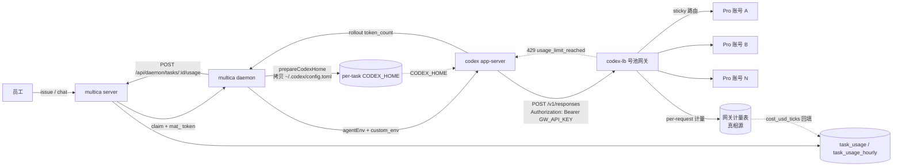
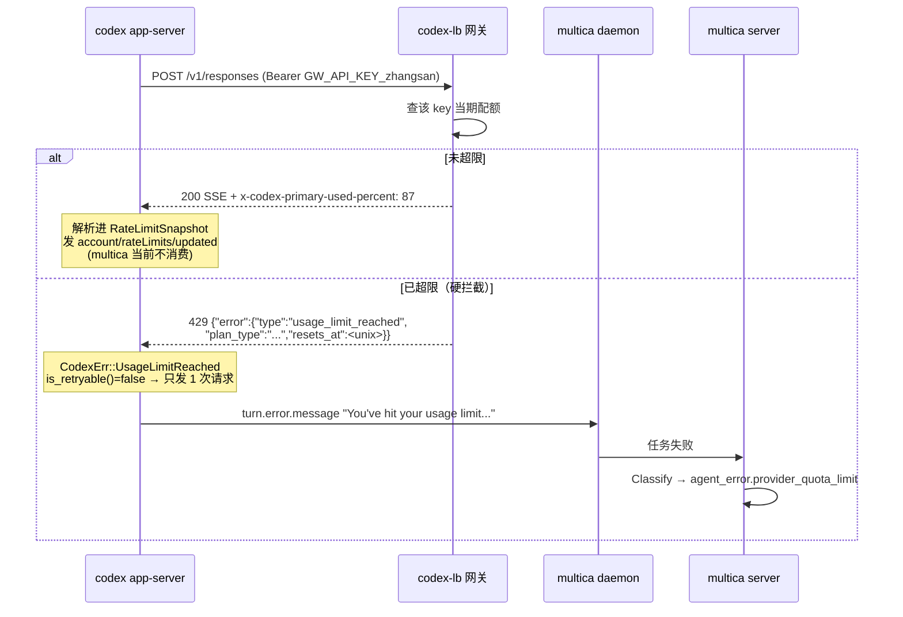

# Codex 号池 × multica 运行时集成方案

> 面向技术评审。所有涉及源码的断言均带 `path:line`。multica 侧路径相对于 multica 仓库根，codex 侧路径相对于 codex 仓库根（`codex-rs/...`）。
> 标注为「未验证 / 待确认」的条目，表示在勘察与验证阶段没有逐行确认，落地前必须先验。

---

## 1. 现状与集成动机

**一句话**：号池网关（codex-lb）能解决"多个 Codex Pro 订阅如何被共享"，但它拿不到"这次调用属于哪个员工、属于哪个任务"——而 multica 恰好已经把人、租户、任务、用量四层建模完毕；反过来 multica 明确拒绝自己做 LLM 代理（`server/cmd/server/router.go:1096-1103`，MUL-4309 注释原文：*"Exposing a general LLM proxy backed by the deployment's own key let any logged-in user run arbitrary completions on our dime"*），所以额度与计费只能落在网关侧。两边各跑各的，结果是**网关有量无人、multica 有人无量**，既做不到按人计量，也做不到超额拦截。

具体缺口：

| 需求 | 号池独立跑 | multica 独立跑 | 打通后 |
|---|---|---|---|
| 额度可见 | 有（按上游账号） | 无（无余额概念，云端计费是外部服务代理，`server/internal/handler/cloud_billing.go:11-41`） | 按人/按池双视图 |
| 按人计量 | 不可能（网关只见 API key） | 有归因字段但无请求级用量（`server/internal/attribution/attribution.go:15-20`） | key ↔ user 映射后可归集 |
| 员工可选 API | 无入口 | 有 runtime / agent 选择器 | runtime = 号池通道 |
| 超额硬拦截 | 可做 | **物理上做不到**——用量只在任务结束时上报一次（`server/internal/daemon/daemon.go:4725-4736`） | 拦截在网关，归因在 multica |

**集成的最小定义**：multica 拉起的 codex 进程把流量打到号池网关，网关拿到足以归因的结构化标识，两边用一个约定的对账键把账合上。不追求 multica 内建号池。

---

## 2. 整体架构

### 2.1 组件与边界

```
[员工] --Web/飞书--> [multica server] --claim--> [multica daemon(宿主机)] --spawn--> [codex app-server]
                          |                                                              |
                          | (用量/归因/看板)                                              | HTTPS (responses wire)
                          v                                                              v
                    Postgres(task_usage/...)  <--cost_usd_ticks 回填--  [codex-lb 号池网关] --> [Codex Pro 账号 1..N]
                                                                              |
                                                                        per-request 计量表(真相源)
```

四条边界，必须显式约定：

1. **凭据边界**：codex 主进程读到网关 key；agent 的 shell 工具子进程**不应该**读到（第 3.2 节给出两种方案的取舍）。
2. **账号边界**：号池内部的"换哪个 Pro 账号"对 codex **完全不可见**。这是本方案相对于"改 multica 的 auth.json symlink"的核心优势——codex 只看见一个 provider、一个 key，`thread`/rollout/resume 语义不受影响，不需要把账号纳入 `codexSessionStoreKey`（`server/internal/daemon/execenv/codex_home.go:395-409`）。
3. **计量边界**：网关按请求计量（真相源），multica 按任务归因（视图）。两边不互相回灌 token 数。
4. **拦截边界**：只在网关。multica 侧任何"任务中途掐断"都不成立。

### 2.2 数据流（mermaid）



### 2.3 超限拦截时序（mermaid）



---

## 3. 集成设计

### 3.1 流量接入：codex 进程如何被指向号池网关

#### 3.1.1 判定结论

经逐条证伪，**唯一干净的路径是「宿主 `~/.codex/config.toml` 里新建自定义 provider」+「环境变量提供 key」**，两者都是零改造。其余四条路径的判定见第 6 节。

关键机制链：

- multica 把宿主 `~/.codex/config.toml` **原样拷贝**进每个 per-task `$CODEX_HOME`（`server/internal/daemon/execenv/codex_home.go:22-30` 定义 `codexCopiedFiles`，`:226-238` `syncCopiedFile`）。
- daemon 只往这份拷贝里 upsert 自己的四个 marker 块（sandbox / multi-agent / memory / shell-environment），**不碰 `[model_providers.*]`**。唯一的表剥离逻辑 `stripCodexUserMcpServerTables` 遇到非 `[mcp_servers.` 的表头就停止剥离（`server/pkg/agent/codex.go:683-712`）。
- codex 侧 `ModelProviderInfo::api_key()` 直接 `std::env::var(env_key)` 取值（`codex-rs/model-provider-info/src/lib.rs:282-300`），且在 `bearer_auth_for_provider` 中**优先于 auth.json / AuthManager**（`codex-rs/model-provider/src/auth.rs:267-276`，`:179-197`）。
- 有 `env_key` 且 `requires_openai_auth` 默认 false 时，不走 first-party auth 路径，**不需要 `codex login`**（`codex-rs/model-provider/src/provider.rs:256-263`，`:347-388`）。

#### 3.1.2 宿主 `~/.codex/config.toml` 内容示例

```toml
# ⚠️ 顶层键必须写在任何 [table] 头之前，否则 TOML 会把它塞进上一个 table。
model_provider = "gw"

# 可选：给 provider 一份模型目录，避免依赖 /models 探测
# multica 会跟随并拷贝这个键指向的文件进 per-task CODEX_HOME
# (server/internal/daemon/execenv/codex_home.go:827-873)
# model_catalog_json = "/etc/codex-pool/models.json"

[model_providers.gw]
name = "Company Codex Pool"
base_url = "https://codex-lb.internal.example.com/v1"
wire_api = "responses"          # 只能是 "responses"，见 6.1
env_key = "GW_API_KEY"          # codex 从环境变量读取，fail-closed
env_key_instructions = "由 multica 下发，请勿手工设置"
```

字段依据（逐字核对）：`base_url` / `env_key` / `env_key_instructions` 定义于 `codex-rs/model-provider-info/src/lib.rs:93-99`；`wire_api` 取值约束在 `:49` 与 `:71-81`；顶层 `model_provider` 与 `openai_base_url` 的消费点在 `codex-rs/core/src/config/mod.rs:3765-3788`。

**不要试图用 `[model_providers.openai]` 覆盖内置 provider**——注册是 `or_insert`（`codex-rs/model-provider-info/src/lib.rs:498`），内置 openai 永远赢。顶层 `openai_base_url` 虽然能改内置 openai 的 base_url（`core/src/config/mod.rs:3765-3771`），但内置 openai 的 `env_key = None`，key 仍走 auth.json，做不到 per-person。

#### 3.1.3 对账标识如何进入网关请求

网关需要知道"这条请求属于哪个 task / 哪个 agent"。daemon 已经把 `MULTICA_TASK_ID` / `MULTICA_AGENT_ID` / `MULTICA_WORKSPACE_ID` 注入 codex 子进程环境（`server/internal/daemon/daemon.go:136-152`，全量 12 个键）。三条候选通路：

| 通路 | 说明 | 状态 |
|---|---|---|
| A. provider 的 HTTP header 配置（形如 `http_headers` / `env_http_headers`） | 若 codex 支持从环境变量映射请求头，则零改造 | **字段名未验证**，落地前必须先在 `codex-rs/model-provider-info/src/lib.rs` 确认 |
| B. wrapper 脚本 | `MULTICA_CODEX_PATH` 指向包装脚本（`server/internal/daemon/agents_probe.go:112-120`、`:155-157`），脚本读环境变量后把 task id 编进 `GW_API_KEY` 的后缀或改写 CODEX_HOME 内 config.toml，再 `exec` 真 codex | 配置即可；wrapper **必须原样透传 `app-server --listen stdio://` 与 stdio** |
| C. 网关侧从 key 反推 | 只按 key 归到人，不归到 task | 零改造，精度最低 |

**推荐 A（若字段存在）→ 退化到 B**。C 作为 P0 阶段的临时口径。

#### 3.1.4 硬约束（落地前必须确认）

1. **wire_api 只剩 `"responses"`**（`codex-rs/model-provider-info/src/lib.rs:49`，`:71-81`）。只实现 chat/completions 兼容的网关**接不上**当前 codex。codex-lb 必须暴露 Responses API。
2. **`/models` 建议实现**：`MODELS_ENDPOINT = "/models"`，5s 超时（`codex-rs/model-provider/src/models_endpoint.rs:37-39`）。缺失不致命——刷新失败只 `error!` 后回落 cache/静态 catalog（`codex-rs/models-manager/src/manager.rs:366-372`）——但建议配 `model_catalog_json` 兜底。
3. **per-task models cache 按 config.toml 指纹绑定**，换 provider 会自动失效重取（`server/internal/daemon/execenv/codex_home.go` 播种逻辑）。
4. **启动硬化不会清掉自定义 env_key**：只清 `LD_*` / `DYLD_*`（`codex-rs/process-hardening/src/lib.rs:60,79,99,125-131`）。

---

### 3.2 身份打通：multica 用户 ↔ 号池密钥

#### 3.2.1 硬事实：per-user 标识不会自动透传到 agent 进程

`taskMulticaEnvironment` 注入子进程的 12 个 MULTICA_* 变量里**没有任何 user 字段**（`server/internal/daemon/daemon.go:136-152`）。对 `server/internal/daemon/` + `server/pkg/agent/` 全量枚举 `MULTICA_[A-Z_]+` 得 107 个变量名，不存在 `MULTICA_USER_ID` / `MULTICA_OWNER_ID` / `MULTICA_INITIATOR_*`。

agent 侧能拿到人的三条路，都不是环境变量：

- `MULTICA_TOKEN`（mat_ 任务票）+ `GET /api/me`：mat_ 在 DB 里绑 `UserID: rt.OwnerID`（`server/internal/handler/daemon.go:1592` 批量 claim、`:2715` 单 claim），middleware 翻译成 `X-User-ID`（`server/internal/middleware/auth.go:85-94`），`/api/me` 挂在纯 Auth 组下且**未包 `RequireHumanActor`**（`server/cmd/server/router.go:1079`，对比 `:1095`）。拿到的是 **runtime owner，不是发起人**。
- `## Task Initiator` 块：只有 type/name/email，**签名不收 ID**（`server/internal/daemon/execenv/runtime_config_sections.go:165-181`）。且该块在 **per-turn user message** 而非 runtime brief（`:161-164`，MUL-5377，为 prompt-cache 前缀稳定性移出）。
- `## Requesting User` 块：来自 runtime owner 的 name + profile_description（`server/internal/handler/daemon.go:1737-1743`）。

#### 3.2.2 映射层选择：`agent_runtime.owner_id`

**推荐把"一个员工 = 一把号池 key"锚定在 `agent_runtime.owner_id`（即一个 runtime = 一把 key）。**

四条理由：

1. 它是 mat_ token `user_id` 的唯一来源（`server/internal/handler/daemon.go:1592`、`:2715`）。
2. claim 时强制非空，否则**直接 CancelTask 并拒绝发票**（`server/internal/handler/daemon.go:1563-1571` 与 `:2687-2700`，MUL-3292），不会出现"跑起来了但没归属"的脏数据。
3. `runtime_id` 已经是 `task_usage_hourly` 的一级 PK 维度（`server/migrations/101_task_usage_hourly_schema.up.sql:40-60`），**按号出日/时报表零 SQL 改造**。
4. 物理上天然一对一：一台机器一个 CLI profile 一个 token 一个 owner（`server/internal/cli/config.go:27`、`:201-225`）。schema 见 `server/migrations/032_runtime_owner.up.sql:1`。

**两个必须写进运维守则的语义泄漏**：

- `agent_runtime.visibility` 默认 `'private'`，可改 `'public'`（`server/migrations/083_runtime_visibility.up.sql:2-3`）。一旦 public，**工作区任何成员派的活都跑在这个 owner 的号上**，"一人一 key"立刻退化成"一机一 key"。→ **号池 runtime 一律强制 private**，并加巡检。
- 同一 user 在多台机器 / 多个 profile 上会有多个 runtime，是 1:N。→ key 签发按 `(user_id, runtime_id)` 而非 `user_id`。

**次选（落地最快、语义最弱）**：`agent.custom_env`（`server/migrations/040_agent_custom_env.up.sql`）。agent 有 `owner_id`（`server/migrations/001_init.up.sql:46`），daemon 无条件铺到子进程（`server/internal/daemon/daemon.go:7603-7616`）。但 1 user : N agent，且 `POST /api/agents` 允许**任意 member** 写 custom_env——代码注释亲口承认这个不对称（`server/internal/handler/agent_env.go:68-72`；`server/internal/handler/agent.go:1156-1157`、`:1222`）。

**明确不能用作归属**：`InitiatorID` 与 `accountable_user_id`。
- `types.go` 原文：*"The agent's effective credentials stay owner-scoped — this is an attested identity, not a credential"*（`server/internal/daemon/types.go:128-138`）。
- attribution 包顶注：*"Nothing in this package is consulted for permission decisions"*（`server/internal/attribution/attribution.go:15-20`）。
- `accountable_user_id` **完全不出现在 daemon 侧代码里**（`rg AccountableUserID server/internal/daemon/` 零命中），不在 claim 响应的 wire 上。
- `InitiatorID` 虽从 claim 响应传到 `TaskContextForEnv.InitiatorID`（`server/internal/daemon/execenv/execenv.go:174`），但生产代码零消费，只在 `_test.go` 出现。

#### 3.2.3 key 的两条下发通路与取舍

| 通路 | 落点 | agent 的 shell 能否看到 key | 改造量 |
|---|---|---|---|
| **T1. `agent.custom_env`** | `PUT /api/agents/{id}/env` → `server/internal/daemon/daemon.go:6103-6112` → `:7603-7616` | **能看到**。custom_env 里的键必进 `shell_environment_policy.include_only`（`server/internal/daemon/daemon.go:7665-7674` + `server/internal/daemon/execenv/codex_shell_env.go:54-110`） | 零改造 |
| **T2. daemon 侧 agentEnv + 含 KEY 的变量名** | `server/internal/daemon/daemon.go:6035-6122` | **看不到**。含 KEY/SECRET/TOKEN 的 explicit 键不会被第一个 `if !isExplicit` 拦下，但随即被 `if _, ok := authorized[upper]; !ok { return }` 丢弃（`server/internal/daemon/execenv/codex_shell_env.go:74-80`），而 authorized 只从 custom_env 派生。codex **主进程**仍通过 `cmd.Env` 拿得到（`server/pkg/agent/codex.go:1008`；`server/pkg/agent/claude.go:880-882` `buildEnv = mergeEnv(os.Environ(), extra)`） | 需改上游 |

**判定**：这条"KEY 类变量被 drop 出 include_only"的规则，对本议题**是特性不是坑**——它正好实现了"codex 主进程能用、agent 的 bash 看不到"。但 T2 需要改 multica。

**P0/P1 用 T1**（`GW_API_KEY` 这个名字含 KEY，走 custom_env 会进 include_only，agent 的 `env` 能看到）。风险可接受的前提是：网关 key 只是号池入场券，泄露后果限于该员工额度，且网关可即时吊销。若安全评审不接受，走 T2。

另注意 `isBlockedEnvKey`（`server/internal/daemon/daemon.go:7549-7559`）拦掉 `MULTICA_*` 与 `HOME/PATH/USER/SHELL/TERM/TMPDIR/TMP/TEMP/CODEX_HOME/REASONIX_STATE_HOME/CURSOR_DATA_DIR/OPENCLAW_*`，**不拦自定义 KEY 名**。

#### 3.2.4 签发流程

```
1. 员工在 multica 完成登录（邮箱验证码 / Google），成为 workspace member
2. 员工本机 `multica login` → 拿 mul_ PAT → daemon 注册 runtime
   → ownerID = member.UserID (server/internal/handler/daemon.go:414-427)
3. 号池控制台（新建，可挂在 multica 路由组下）读 X-User-ID + workspace member
   → 为 (user_id, runtime_id) 签发 GW_API_KEY_xxx
   → 通过 PUT /api/agents/{id}/env 写入该员工名下 agent 的 custom_env
4. 撤销：号池侧吊销 key（立即生效，不受 multica 缓存影响）
```

**取号/换号端点必须挂 `handler.RequireHumanActor`**（`server/internal/handler/actor_guards.go:96-108`，用法见 `server/cmd/server/router.go:1095`），防止被 prompt injection 劫持的 agent 用宿主凭证动号池。注意副作用：agent 侧就永远调不通这些端点——这是刻意的。

#### 3.2.5 外部 IdP（飞书登录）

**不支持，必须自己写。** 全部 auth 路由只有 4 条：`/auth/send-code`、`/auth/verify-code`、`/auth/google`、`/auth/logout`（`server/cmd/server/router.go:982-985`；前端仅调这四条，`packages/core/api/client.ts:626-647`）。Google 端点硬编码、无 issuer/discovery 抽象（`server/internal/handler/auth.go:489`、`:522`）。word-boundary grep `\boidc\b|\bsaml\b|\bopenid\b|\bsso\b` 覆盖 `server/` + `.env.example` + `SELF_HOSTING*.md`：认证相关零命中。

飞书现有能力是**账号映射不是登录**：`channel_user_binding`（`server/migrations/124_channel_generalization.up.sql:130-156`，channel_type 字面量是 `'feishu'` 不是 `'lark'`）；`RedeemAndBind` 身份取自会话而非 token，非 workspace 成员返回 `ErrBindingNotWorkspaceMember` 且**不消耗 token**（`server/internal/integrations/lark/binding_token.go:146-176`）。**不存在"飞书扫码自动开户"路径。**

本方案的立场：**飞书登录不纳入本期范围**。准入用零改造的 `ALLOWED_EMAIL_DOMAINS`（`server/cmd/server/router.go:221-223`；`server/internal/handler/auth.go:225-257`），注意它**只管建号不管停号**（`:226-228` `if !isNewUser { return nil }`）。

---

### 3.3 配额与拦截

#### 3.3.1 拦截只能在网关

multica 的用量在 `runner.run` 返回后才上报（`server/internal/daemon/daemon.go:4725-4736`），无中途流式计量，**物理上做不到"跑到一半发现超额就掐断"**。multica 侧的额度只能做到"下一个任务不给派"的粒度。

#### 3.3.2 拒绝形式的重试放大系数（这是本节最重要的结论）

codex 有**双层重试**：

- 传输层：`ApiRetryConfig { max_attempts: 4, base_delay: 200ms, retry_429: false, retry_5xx: true, retry_transport: true }`（`codex-rs/model-provider-info/src/lib.rs:264-270`），`run_with_retry` 是 `for attempt in 0..=max_attempts` → **5 次**（`codex-rs/codex-client/src/retry.rs:60`）。
- turn 层：`DEFAULT_STREAM_MAX_RETRIES = 5`（`codex-rs/model-provider-info/src/lib.rs:26`、`:311-315`），循环在 `codex-rs/core/src/session/turn.rs:1364-1436`，退避 200/400/800/1600/3200 ms ×0.9~1.1 抖动（`codex-rs/core/src/util.rs:6-7, 86-91`）。
- 是否重试由 `CodexErr::is_retryable()` 决定（`codex-rs/protocol/src/error.rs:362-401`）。

| 拒绝形式 | codex 内部错误 | 重试 | 实际 HTTP 请求数 |
|---|---|---|---|
| **429 + `{"error":{"type":"usage_limit_reached",...}}`** | `UsageLimitReached` | 否 | **1** ✅ |
| 429 + `{"error":{"type":"usage_not_included"}}` | `UsageNotIncluded` | 否 | 1 |
| 429 + 其它 body | `RetryLimit` | 否 | 1（文案退化） |
| 400 | `InvalidRequest` | 否 | 1 |
| 503 + `error.code` = `server_is_overloaded`/`slow_down` | `ServerOverloaded` | 否 | 1 |
| **402 / 403 / 401 / 404** | `UnexpectedStatus` | **是** | **6**（~6.2 秒） ⚠️ |
| **500 / 502 / 其它 5xx** | `InternalServerError` / 传输层重试 | **是（双层）** | **最多 30** ☠️ |
| SSE 中途 `response.failed` + 未识别 `error.code` | `Retryable` → `Stream` | **是** | **6** ⚠️ |

`error.type` 的解析点在 `codex-rs/codex-api/src/api_bridge.rs:218-229`（取值 `usage_limit_reached` / `usage_not_included`，另有 `plan_type`、`resets_at`）。

#### 3.3.3 网关侧契约（强制）

1. **硬拒绝一律 HTTP 429**，body 必须是：
   ```json
   {"error":{"type":"usage_limit_reached","plan_type":"company_pool","resets_at":1786000000}}
   ```
   这是唯一「1 次请求即终止 + 文案友好 + multica 能正确分类成 `provider_quota_limit`」的组合。可选带 `x-codex-active-limit`（`api_bridge.rs:161`）+ `x-codex-{limit}-limit-name` 让文案带上具体额度名。
2. **禁止用 402/403/401 表达配额**（→ 6 次重试）。403 尤其坑：body 含 `"Cloudflare"` 且含 `"blocked"` 时文案会被替换成 Cloudflare 提示（`api_bridge.rs:181-190`），完全误导。
3. **严禁用 5xx 表达配额**（→ 最坏 30 次请求，等于自我打爆）。
4. **SSE 已开流后的拒绝**：`response.failed` 的 `error.code` 必须写 `insufficient_quota` 或 `usage_not_included`，任何其它值都会被当成可重试（`codex-rs/codex-api/src/sse/responses.rs:102-110`、`:408-435`、`:669-690`）。注意 `rate_limit_exceeded` 会触发从 message 里正则抠退避秒数（`try_parse_retry_after`，`:644-667`）。
5. **软预警**：正常 200 响应带上 `x-codex-primary-used-percent` / `x-codex-primary-window-minutes` / `x-codex-primary-reset-at` / `x-codex-credits-balance`（头名与解析规则见 `codex-rs/codex-api/src/rate_limits.rs:57-101, 179-191, 217-229`；`used_percent` 必须存在且「非 0 或有 window_minutes 或有 reset_at」才算有数据，`:205-207`）。codex 会解析并通过 `account/rateLimits/updated` 发出来（`codex-rs/app-server-protocol/src/protocol/common.rs:1747`；`bespoke_event_handling.rs:1577-1600` 无条件发），但 **multica 今天不消费**——见 3.5.3。

#### 3.3.4 multica 侧的收尾行为

终态错误经 `turn.error.message` 传给 multica（`server/pkg/agent/codex.go:3013-3018`），进 `taskfailure.Classify`：

- `"...usage limit..."` → `agent_error.provider_quota_limit`（`server/pkg/taskfailure/classify.go:122-137`）
- `"...429..."` → `agent_error.provider_capacity_or_rate_limit`（`classify.go:140-147`）

**两者都不在 `retryableReasons`**（`server/internal/service/task.go:4178-4185`，当前集合是 `{runtime_offline, runtime_recovery, timeout, codex_semantic_inactivity, agent_error.provider_network, skill_bundle_unavailable}`）→ 任务终结，multica 不再重试。

**这是刻意保留的**：号池方案下"换号"发生在网关内部，multica 层面看到 429 就应该终结，避免与网关的退避策略打架。只有在网关**全池耗尽**时才应该返回 429，此时 multica 重试也无意义。

（若后续要做"配额触发自动换 runtime"，见 4.4 与 5.5。）

---

### 3.4 用量归集

#### 3.4.1 判定：网关是唯一真相源

multica 现有的 codex 用量采集实际跑在最差的一条路上：

- 主通道 `extractUsageFromMap` 挂在 `task_complete`(v1 遗留) 和 `turn/completed` 的 `params.turn` 上（`server/pkg/agent/codex.go:2968`、`:3031-3034`）。
- **这条通道对当前 codex 恒为空**：app-server v2 的 `Turn` 结构体只有 `id/items/itemsView/status/error/startedAt/completedAt/durationMs`，**没有 `usage` 字段**（`codex-rs/app-server-protocol/src/protocol/v2/thread_data.rs:268-288`）。`task_complete` 是 v1 事件，v2 不发。
- 所以 `codex.go:1681` 的 `if u.InputTokens == 0 && u.OutputTokens == 0` 永远为真，**每次都落到 `scanCodexSessionUsage`**——扫 rollout JSONL（`codex.go:1677-1689`、`:3247-3284`）。

精度问题（逐条）：

| 问题 | 证据 |
|---|---|
| `cache_write` 全丢：`codexRawTokenUsage` 无 `cache_write_input_tokens` 字段 | `server/pkg/agent/codex.go:3404-3410`；codex 侧有，`codex-rs/protocol/src/protocol.rs:2070-2071` |
| 一个 task 只有一行、一个模型标签，且 DB 是 REPLACE 不是累加 | `codex.go:1691-1697`；`server/pkg/db/queries/task_usage.sql:1-19` |
| 子 agent 用量不可见（delegate 的 `TokenCount` 被丢弃） | `codex-rs/core/src/codex_delegate.rs:320-327`；multica 默认关原生 multi-agent，`server/internal/daemon/execenv/codex_multi_agent.go:16-31` |
| 只在任务结束报一次，daemon 崩溃 = 整轮账丢光 | `server/internal/daemon/daemon.go:4725-4736` |
| resume 靠时间戳做差，且 `fill_to_context_window` 会把 `total_token_usage` 伪造成 `{total_tokens: context_window, 其余全 0}` 把基线算歪 | `codex.go:3438-3516`、`:3549-3554`；`codex-rs/protocol/src/protocol.rs:2128-2141` |
| 7 天以上 rollout 被压成 `.zst`，而 multica 只 glob `rollout-*.jsonl` | `codex-rs/rollout/src/compression.rs:18`、`:256`；`codex.go:3300-3303` |

网关侧在 `response.completed` 上能拿到（`codex-rs/codex-api/src/sse/responses.rs:122-156`）：`usage.input_tokens`、`usage.input_tokens_details.cached_tokens`、`usage.input_tokens_details.cache_write_tokens`、`usage.output_tokens`、`usage.output_tokens_details.reasoning_tokens`、`usage.total_tokens`、`usage.codex_rollout_budget_units`；外加 `openai-model` 响应头给出**真实服务端模型**（`responses.rs:30`、`:46-50`）和 `x-request-id`（`responses.rs:31`）。

**粒度是「请求 × 真实模型」，同步、不依赖磁盘、不依赖 agent 进程存活、覆盖子 agent 与压缩请求。数量级优于 multica 侧。**

#### 3.4.2 双重记账风险与口径统一

multica 全仓只有一个 `task_usage` 写入点（`server/internal/handler/daemon.go:3636`，唯一的 `UpsertTaskUsage` 调用方），网关写自己的表，**不会自动双重记账**。但四个口径冲突必须提前定死：

1. **粒度无法 join**：multica 是 per-(task, provider, model)，网关是 per-request，codex→multica 链路上**没有任何请求级 ID 传下来**（multica 不读 `x-request-id`，也不读 `rawResponse/completed` 的 `responseId`）。
2. **桶定义相反**：multica 的 codex 行 `input_tokens` 是**已减 cached** 的（`codexUncachedInputTokens`，`server/pkg/agent/codex.go:3202`、`:3208-3214`），`cache_write_tokens` 恒 0；网关拿到的 `input_tokens` 是**含 cached** 的原始值。直接相加或比对必然差一个 cached 量级。
3. **成本口径分裂**：UI 金额全在浏览器算（`packages/views/runtimes/utils.ts:191-256`、`:600-616` 的 `MODEL_PRICING`），服务端定价表 `server/internal/metrics/pricing.go:14-77` 只喂 Prometheus，两表要手工同步且别名规则不同。
4. **指标层没有"计量来源"维度**：`server/internal/metrics/labels.go:48-51` 的 `labelSource` 是任务来源（chat/autopilot/manual…），不是 metering source。

#### 3.4.3 合并规则（强制）

```
规则 1：网关的 per-request 表是唯一真相源。
        主键含 (x-request-id | responseId)，附 账号ID、GW key ID、真实 model、六个 token 桶。

规则 2：绝不把 token 数回灌进 multica 的 task_usage。
        UpsertTaskUsage 是 REPLACE (task_usage.sql:1-19)，会与 agent 自报互相覆盖；
        换 provider 名新增一行则会让 task_usage_hourly 同一 workspace 同一小时出现两份 token。

规则 3：只回填 cost_usd_ticks（1e-10 USD 整数）。
        通道：TaskUsagePayload.cost_usd_ticks → task_usage.cost_usd_ticks
        (server/internal/handler/daemon.go:3580-3597；server/migrations/213_task_usage_authoritative_cost.up.sql:22-26)
        前后端会自动优先用真实值而不是估算。
        ⚠️ authoritativeCostTicks 把 <=0 一律写成 NULL；0 会被读成"确实花了 $0"从而压制估算。

规则 4：对账键 = MULTICA_TASK_ID（经 3.1.3 的 A/B 通路透成请求头）。
        网关按 task 聚合金额 → 回填。粒度对齐 multica 的 (task_id, provider, model)。

规则 5：按人归因用 agent_task_queue.accountable_user_id / originator_user_id
        (server/internal/attribution/attribution.go:1-21；server/migrations/185_agent_task_accountable_user.up.sql:1-5)，
        不要用凭证——凭证永远是 runtime owner。
        现有报表 SQL 已是 task_usage JOIN agent_task_queue 的标准写法
        (server/pkg/db/queries/task_usage.sql:38-46)，加一个 GROUP BY 即可出"人均花费"。
```

#### 3.4.4 rollup 与回补

- `rollup_task_usage_hourly_window(p_from, p_to)` 是**幂等 REPLACE** 语义（`server/migrations/102_task_usage_hourly_pipeline.up.sql:274-398`），可以随便重跑、随便回补，不会重复计费。任何写 `task_usage` 的外部程序只要 bump `updated_at`，下一个 tick 就会自动重算对应桶。
- 必须持 advisory lock **4246**（`server/internal/taskusagebackfill/backfill.go:1-24`、`:38-56`）。
- 历史回填直接照抄 `server/cmd/backfill_codex_usage_cache/main.go:99-156`、`:260-309` 的「dry-run → 批量 SKIP LOCKED → advisory lock → databaseClock 圈窗口 → rollup 重建」流程。
- ⚠️ `task_usage_hourly.uncosted_*` 是 NULLABLE 且**故意**不给 DEFAULT 0（`server/migrations/213_task_usage_authoritative_cost.up.sql:41-52`）：NULL 表示"这个桶还没被重算过，整桶都要估算"。写成 NOT NULL DEFAULT 0 会把历史桶成本瞬间清零。

---

### 3.5 可观测与审计

#### 3.5.1 采什么

**网关侧（真相源）**，每请求一行：

| 字段 | 来源 |
|---|---|
| `request_id` | `x-request-id`（`codex-rs/codex-api/src/sse/responses.rs:31`） |
| `served_model` | `openai-model` 响应头（`responses.rs:30`、`:46-50`） |
| `pool_account_id` | 网关内部路由决策 |
| `gw_key_id` → `multica_user_id` / `runtime_id` | 3.2.4 签发时建立的映射 |
| `multica_task_id` / `multica_agent_id` | 3.1.3 通路 A/B |
| 六个 token 桶 | `usage.*`（`responses.rs:122-156`） |
| `status` / `latency_ms` / `retry_seq` | 网关自身 |
| 上游额度快照 | 上游返回的 `x-codex-*` 头（`codex-rs/codex-api/src/rate_limits.rs:57-101`） |

**multica 侧（归因视图）**：`task_usage` / `task_usage_hourly` / `agent_task_queue.failure_reason` / `accountable_user_id`，以及 Prometheus 的 `multica_llm_tokens_total{provider,model,token_type,runtime_mode,source}`、`multica_llm_cost_usd_total`、`multica_llm_unpriced_tokens_total`、`multica_llm_request_total`（`server/internal/metrics/business.go:112-134`、`:257-301`）。

#### 3.5.2 不采什么（硬红线）

- **不落对话内容**：不存 prompt、不存 completion、不存 tool 参数、不存文件路径。网关只从 SSE 的 `usage` 段与响应头取结构化字段，正文透传不落盘。
- **不把 secret 放 argv**：`agent command` 日志行会打印完整 argv（`server/pkg/agent/codex.go:1005` `Logger.Info("agent command", "exec", execPath, "args", codexArgs)`）。任何塞进 `ExtraArgs` / `CustomArgs` 的 key 都会落日志。这也是不用 `-c` 传 key 的原因。
- **不高频轮询 agent env**：`GET /api/agents/{id}/env` 每次 reveal 都写 `activity_log`（`agent_env_revealed`），且是 **fail-closed**——审计写不进去就拒绝返回明文（`server/internal/handler/agent_env.go:128-139`）。号池自动化轮询会刷爆 activity_log 且 activity_log 故障会让号池读不到配置。
- **Prometheus 不加 account/user 标签**：`server/internal/metrics/labels.go` 是集中式白名单，改一处即可，但**基数会爆**。按号看走网关侧的表，不走 Prometheus。

#### 3.5.3 已知的未接通信号（可选补齐，各约 10 行）

codex 提供但 multica 完全不消费的三个通道：

| 通道 | 方法名 | multica 状态 |
|---|---|---|
| 每次 token_count | `thread/tokenUsage/updated`（`codex-rs/app-server-protocol/src/protocol/common.rs:1711`） | 未订阅 |
| 每次上游请求 | `rawResponse/completed`（`common.rs:1725`） | 显式关闭——`server/pkg/agent/codex.go:1797` 硬写 `"experimentalRawEvents": false`（开关说明见 `codex-rs/app-server/src/thread_lifecycle.rs:316-321`） |
| 额度快照 | `account/rateLimits/updated`（`common.rs:1747`） | 未订阅 |

`handleRawNotification` 的 switch 只有 `turn/started`、`turn/completed`、`error`、`thread/status/changed`、`item/*`，其余全落 default 丢弃（`server/pkg/agent/codex.go:2993-3078`）。另外 `codexSessionTokenCount`（`codex.go:3413-3425`）只解 `payload.info`，**不解 `payload.rate_limits`**——尽管 codex 把 `TokenCountEvent { info, rate_limits }` 整个写进了 rollout（`codex-rs/rollout/src/policy.rs:98`；`codex-rs/core/src/session/mod.rs:3967`）。

**本方案不依赖这三个通道**（网关侧已有更好的数据），但若要在 multica UI 里显示"额度剩余"，最小改动是在 `codex.go:2993` 的 switch 加一个 `account/rateLimits/updated` case。

---

## 4. 改造清单

### 4.1 零改造（今天就能用）

| 项 | 落点 |
|---|---|
| per-task CODEX_HOME 会原样拷贝宿主 config.toml | `server/internal/daemon/execenv/codex_home.go:22-30`、`:226-238` |
| daemon 托管块不碰 `[model_providers.*]` | `server/pkg/agent/codex.go:683-712` |
| `filterCodexConfigOverrides` 放行 `-c model_provider=…` | `server/pkg/agent/codex.go:388-455` |
| custom_env 注入子进程 | `server/internal/daemon/daemon.go:6103-6112`、`:7603-7616` |
| `isBlockedEnvKey` 不拦自定义 KEY 名 | `server/internal/daemon/daemon.go:7549-7559` |
| `runtime_id` 已是 `task_usage_hourly` 一级维度 → 按号出报表 | `server/migrations/101_task_usage_hourly_schema.up.sql:40-60` |
| `cost_usd_ticks` 权威成本通道全链路就绪 | `server/internal/handler/daemon.go:3580-3597`；`server/migrations/213_task_usage_authoritative_cost.up.sql:22-26` |
| `rollup_task_usage_hourly_window` 幂等重算原语 | `server/migrations/102_task_usage_hourly_pipeline.up.sql:274-398` |
| `RequireHumanActor` 一行挂上即可拦 agent | `server/internal/handler/actor_guards.go:96-108` |
| 回填流程模板 | `server/cmd/backfill_codex_usage_cache/main.go:99-156`、`:260-309` |
| Prometheus 五维指标可直接抓 | `server/internal/metrics/business.go:112-134` |

### 4.2 配置即可

| 项 | 落点 / 动作 |
|---|---|
| 宿主 `~/.codex/config.toml` 写 `[model_providers.gw]` + `model_provider = "gw"` | 每台 daemon 宿主机 |
| 通过 `PUT /api/agents/{id}/env` 下发 `GW_API_KEY` | `server/cmd/server/router.go:1552-1553` |
| 号池 runtime 强制 `visibility='private'` | `server/migrations/083_runtime_visibility.up.sql:2-3` |
| 准入收口 `ALLOWED_EMAIL_DOMAINS` / `DISABLE_WORKSPACE_CREATION` | `server/cmd/server/router.go:221-223`；`server/internal/handler/auth.go:225-257` |
| （可选）wrapper 脚本走 `MULTICA_CODEX_PATH` 透传 task id | `server/internal/daemon/agents_probe.go:112-120`、`:155-157` |
| （可选）`model_catalog_json` 兜底模型目录 | `server/internal/daemon/execenv/codex_home.go:827-873` |
| 前端补模型费率（需同步 Go 侧） | `packages/views/runtimes/utils.ts:191-256` + `server/internal/metrics/pricing.go:22-77` |

### 4.3 小改造（不改 multica 上游，改号池侧 / 加新 handler）

| 项 | 落点 |
|---|---|
| 网关实现 Responses API + `/models` + 429 契约 | codex-lb |
| 网关 per-request 计量表 + sticky 路由（保 prompt cache） | codex-lb |
| 号池控制台（key 签发/吊销/额度），挂在 multica 已有 Auth + RequireWorkspaceMember 路由组下 | 读 `X-User-ID` / `middleware.MemberFromContext`（`server/internal/middleware/workspace.go:22-31`、`:261`） |
| `cost_usd_ticks` 回填作业（按 task 聚合金额写回） | 新增 scheduler JobSpec，模板见 `server/internal/scheduler/jobs_task_usage.go:36-56`，注册点 `server/cmd/server/main.go:468-481` |
| 按人报表 SQL：`GROUP BY atq.accountable_user_id` | `server/pkg/db/queries/task_usage.sql:38-46` |
| 立即封号需 `Invalidate` Redis key | `mul:auth:pat:`（`server/internal/auth/pat_cache.go:19,23`）、`mul:auth:member:`（`server/internal/auth/membership_cache.go:12,19`） |

### 4.4 需改上游 multica

| 项 | 落点 | 触发条件 |
|---|---|---|
| key 走 daemon 侧 agentEnv 而非 custom_env（对 agent shell 不可见） | `server/internal/daemon/daemon.go:6035-6122` | 安全评审不接受 3.2.3 T1 |
| 消费 `account/rateLimits/updated`，在 UI 显示额度 | `server/pkg/agent/codex.go:2993` switch 加 case | 要在 multica 里看额度 |
| 采 `cache_write_input_tokens` | `server/pkg/agent/codex.go:3404-3410` | 要 multica 侧口径与网关对齐 |
| 订阅 `thread/tokenUsage/updated`，摆脱 rollout 扫盘 | `server/pkg/agent/codex.go:2993-3078` | 要提高 multica 侧精度 |
| 配额触发自动换号：`retryableReasons` 加 `provider_quota_limit` / `provider_capacity_or_rate_limit`，并让 `CreateRetryTask` 选不同 runtime_id | `server/internal/service/task.go:4178-4185`、`:4196-4229` | 要跨 runtime 故障转移（本方案默认不需要，换号在网关内部） |
| per-task 动态换号（而非 per-agent 静态） | claim 响应结构 + `server/internal/handler/daemon.go:1572-1594` + `taskMulticaEnvironment` | 本方案默认不需要 |
| 飞书登录 | 照抄 `server/internal/handler/auth.go:464-615`，新增 `/auth/feishu`，复用 `findOrCreateUser`（`:167-194`）+ `issueJWT`（`:152-161`）+ `SetAuthCookies`，并在 `server/internal/handler/config.go:74-78` 加前端开关 | 本期不做 |
| task_usage 加账号维度（扩唯一键） | `server/pkg/db/queries/task_usage.sql:1-19` + migration + 触发器 | **不推荐**，与规则 2 冲突 |

---

## 5. 实施路径

每个阶段可独立停止，停在任何一阶段都有可交付价值。

### P0 — 单机贯通验证（不影响任何在跑的任务）

1. 挑一台非生产 daemon 宿主机，写 `~/.codex/config.toml` 的 `[model_providers.gw]`。
2. 通过 `PUT /api/agents/{id}/env` 给一个测试 agent 写 `GW_API_KEY`。
3. 跑一个 task，验证：
   - 请求确实打到网关（网关侧有日志）；
   - per-task `$CODEX_HOME/config.toml` 里 `[model_providers.gw]` 完整存在（确认 3.1 的拷贝链路成立）；
   - prompt cache 命中率与直连基线一致（multica 会打 prompt-cache 命中率日志，`server/internal/handler/daemon.go:3599-3669`）。
4. **验收即停止点**：证明"零改造接网关"成立。

### P1 — 全员铺开 + 按人发 key

1. 号池控制台上线：读 `X-User-ID` 签发 `(user_id, runtime_id) → GW_API_KEY`，端点挂 `RequireHumanActor`。
2. 各 daemon 宿主机统一下发 config.toml（配置管理工具）。
3. 强制号池 runtime `visibility='private'`，加巡检告警。
4. **停止点**：多个 Pro 订阅被共享，每个员工一把独立 key，网关侧已能按人看用量。此时 multica 侧看板仍是估算金额。

### P2 — 用量归集与看板

1. 网关 per-request 计量表落地，字段按 3.5.1。
2. 打通对账键（3.1.3 通路 A 或 B）。
3. 上线 `cost_usd_ticks` 回填 job（scheduler JobSpec，持 advisory lock 4246）。
4. 报表 SQL 加 `GROUP BY accountable_user_id`。
5. **停止点**：multica 看板显示真实金额而非估算，且能出"人均花费"。

### P3 — 配额与拦截

1. 网关实现 per-key 配额，硬拒绝严格按 3.3.3 契约（429 + `usage_limit_reached`）。
2. 正常响应带 `x-codex-*` 软预警头。
3. 验证：codex 侧确实只发 1 次请求；multica 的 `failure_reason` 正确落成 `agent_error.provider_quota_limit`。
4. **停止点**：额度可控，超额行为可预测。

### P4 — 精度与体验补齐（需改上游，可选）

按 4.4 表逐项挑，每项互相独立：
- 消费 `account/rateLimits/updated` → multica UI 显示额度；
- 采 `cache_write` / 订阅 `thread/tokenUsage/updated` → multica 侧口径对齐；
- key 迁到 daemon 侧 agentEnv → 对 agent shell 不可见。

---

## 6. 关键技术判定（硬结论汇总）

### 6.1 能 / 不能

| # | 判定 | 结论 | 证据 |
|---|---|---|---|
| 1 | 用 `OPENAI_BASE_URL` 环境变量改 base_url | **不能** —— codex 里根本没有这个环境变量，只有 config.toml 的 `openai_base_url` 键 | `codex-rs/config/src/config_toml.rs:379`；唯一消费处 `codex-rs/core/src/config/mod.rs:3765-3771` |
| 2 | 用 `CODEX_API_KEY` 环境变量注入 key | **不能** —— app-server 模式下 env 直通路被硬关：`AuthManager::shared_from_config(&config, /*enable_codex_api_key_env*/ false)` | `codex-rs/app-server/src/lib.rs:511`、`:751`；门控点 `codex-rs/login/src/auth/manager.rs:1380-1385` |
| 3 | 用 `[model_providers.openai]` 覆盖内置 provider | **不能** —— 注册是 `or_insert`，内置永远赢 | `codex-rs/model-provider-info/src/lib.rs:498`（上下文 `:459-501`） |
| 4 | 只做 chat/completions 兼容的网关 | **接不上** —— `wire_api = "chat"` 已移除，只接受 `"responses"` | `codex-rs/model-provider-info/src/lib.rs:49`、`:71-81` |
| 5 | 自定义 provider + `env_key` 是否绕开 auth.json | **能** —— `api_key()` 直读 env，且在 `bearer_auth_for_provider` 中优先于 auth.json | `model-provider-info/src/lib.rs:282-300`；`model-provider/src/auth.rs:267-276`、`:179-197` |
| 6 | 是否还需要 `codex login` | **不需要** —— 有 `env_key` 且 `requires_openai_auth` 默认 false 时不走 first-party auth | `codex-rs/model-provider/src/provider.rs:256-263`、`:347-388` |
| 7 | 写宿主 config.toml 是否会被 multica 改坏 | **不会** —— 只拷贝 + upsert marker 块；mcp 表剥离遇非 mcp 表头即停 | `execenv/codex_home.go:22-30`、`:226-238`；`pkg/agent/codex.go:683-712` |
| 8 | `-c` 能否作用于 app-server | **能**（`--config` 是 `global = true`），但**不该用来传 key** —— argv 全量落日志 | `codex-rs/utils/cli/src/config_override.rs:29-36`；`codex-rs/cli/src/main.rs:1177-1188`；`codex-rs/app-server/src/lib.rs:480-495`；日志 `server/pkg/agent/codex.go:1005` |
| 9 | codex cloud-config 远程下发 | **完全不可用** —— 要求 ChatGPT 登录态 + business/Enterprise/Edu plan，bundle 在 OpenAI 后台编写，自己无法生产 | `codex-rs/cloud-config/src/service.rs:48-55`；`codex-rs/cloud-config/src/backend.rs:61-85` |
| 10 | codex managed config（`/etc/codex/managed_config.toml`） | **技术可行但更差** —— requirements 那半没有 model_providers/base_url 字段；作为 precedence 40 的层能设 base_url，但要 root、host 全局（做不到 per-person）、盖掉 `-c`（封死逃生口） | 字段表 `codex-rs/config/src/config_requirements.rs:925-962`；双写 `codex-rs/config/src/loader/mod.rs:416-440` 与 `:225-230`；路径写死 `loader/layer_io.rs:20`；层优先级 `config/src/config_layer_source.rs:33-52` |
| 11 | 重定向 `CODEX_HOME` 换号 | **不可用** —— 在 `isBlockedEnvKey` 黑名单里，且 daemon 已把它指向 per-task 目录 | `server/internal/daemon/daemon.go:7555`、`:6069-6071` |
| 12 | multica 支持 OIDC / SSO | **不支持** —— 全部 auth 路由 4 条，Google 端点硬编码无 discovery 抽象；word-boundary grep 零命中 | `server/cmd/server/router.go:982-985`；`server/internal/handler/auth.go:477-486`、`:489`、`:522` |
| 13 | 飞书扫码自动开户 | **不存在** —— `RedeemAndBind` 身份取自会话，非 workspace 成员直接拒绝且不消耗 token | `server/internal/integrations/lark/binding_token.go:146-176` |
| 14 | per-user 标识透传到 agent 进程 | **无环境变量通道**（107 个 MULTICA_* 无一个 user 字段）；唯一可编程通道是 mat_ + `GET /api/me`，且拿到的是 runtime owner | `server/internal/daemon/daemon.go:136-152`；`server/cmd/server/router.go:1079`；`server/internal/handler/auth.go:423-435` |
| 15 | multica 中途硬拦截超额 | **物理上不可能** —— 用量只在 `runner.run` 返回后上报一次 | `server/internal/daemon/daemon.go:4725-4736` |
| 16 | multica 的 codex 用量走协议通道 | **实际恒走 rollout 扫盘** —— v2 `Turn` 无 `usage` 字段 | `codex-rs/app-server-protocol/src/protocol/v2/thread_data.rs:268-288`；回落逻辑 `server/pkg/agent/codex.go:1677-1689` |

### 6.2 可绕过 / 不可绕过

| 约束 | 性质 |
|---|---|
| `--listen stdio://` 被 `codexBlockedArgs` 硬拦截 | **不可绕过**（`server/pkg/agent/codex.go:32-34`、`:263-270`）；wrapper 必须原样透传 |
| `CODEX_HOME` 用户不可覆盖 | **不可绕过**（`server/internal/daemon/daemon.go:7555`） |
| 含 KEY/SECRET/TOKEN 的 agentEnv 变量被 drop 出 `include_only` | **可利用**（这是 3.2.3 T2 的实现基础）。规则精确版：走 explicit 分支不会被第一个 `if !isExplicit` 拦下，但随即被 `if _, ok := authorized[upper]; !ok { return }` 丢弃，authorized 只从 custom_env 派生（`server/internal/daemon/execenv/codex_shell_env.go:74-80`；`server/internal/daemon/daemon.go:7665-7674`）。**只影响 codex spawn 的 shell 工具子进程，codex 主进程仍通过 `cmd.Env` 拿得到**（`server/pkg/agent/codex.go:1008`） |
| `sandbox_mode = "danger-full-access"`（Linux） | **不可绕过**，且写失败是 fatal（`server/internal/daemon/execenv/codex_sandbox.go:98-132`、`:440-478`；`execenv/codex_home.go:281-292`）。隔离边界是 daemon 自身所处的 VM/容器/专用用户（`codex_sandbox.go:324-326`，MUL-5578）。**号池 key 在文件系统/进程环境上对 agent 是可读的，这一点不可能靠 multica 解决** |
| HOME / XDG 故意不改 | **不可绕过**（`server/internal/daemon/daemon.go:6072-6076`）。agent 能读到宿主用户的全部凭据 |
| `POST /api/agents` 允许任意 member 写 custom_env | **已知不对称**，代码注释亲口承认（`server/internal/handler/agent_env.go:68-72`）。号池 key 若走 custom_env，任何 member 可创建带任意 key 的 agent |
| PAT 事实上永不过期 | daemon 每 3 天续期（`server/internal/daemon/daemon.go:3067`、`:3087`），剩余 < 7 天推到 +90 天（`server/internal/handler/personal_access_token.go:22-28`）；不传 `expires_in_days` 则 `expires_at` 为 NULL（`:82-88`） |
| 撤销延迟最长 10 分钟 | `AuthCacheTTL = 10min`（`server/internal/auth/pat_cache.go:19`）+ `MembershipCacheTTL = 5min`（`server/internal/auth/membership_cache.go:19`）。**号池"立即封号"必须在网关侧做，不要依赖 multica 的凭证撤销** |
| `JWT_SECRET` 有硬编码默认值 | `"multica-dev-secret-change-in-production"`（`server/internal/auth/jwt.go:12`），未设环境变量时静默使用。号池控制台若与 multica 共用 JWT 域，这是致命项，部署 checklist 必须包含 |
| `MULTICA_DEV_VERIFICATION_CODE` 固定验证码 | `APP_ENV != "production"` 时任何邮箱可用固定 6 位码登录（`server/internal/handler/auth.go:123-134`）。**`APP_ENV` 拼错（如 `"prod"`）等于全站后门** |

### 6.3 与上游勘察结论的修正

以下几条推翻或收窄了初期勘察结论，评审时以本节为准：

1. 「协议层没有账号/凭据字段，账号只能通过 CODEX_HOME/auth.json 或环境变量决定」——前半句对，结论收窄错了。真正的通道是 config.toml 里的自定义 `[model_providers.<id>]` + `env_key`，环境变量只是该 provider 定义的取值来源。**单靠环境变量在 `codex app-server` 下全部无效。**
2. 「下发 `model_providers.X.base_url` 需要照抄 marker + upsert 模式（小改造）」——**不需要改 multica**，写宿主 `~/.codex/config.toml` 即可，是零改造。
3. 「`## Task Initiator` 属于 runtime brief」——实际在 **per-turn user message**，为 prompt-cache 前缀稳定性从 brief 移出（`server/internal/daemon/execenv/runtime_config_sections.go:161-164`，MUL-5377）。该块不进缓存前缀，每轮重发。且**不含 ID**，只有 type/name/email。
4. 「`agent_error.provider_quota_limit` 是号池要补的空白（应加进 retryableReasons）」——在本方案下**不该加**。换号发生在网关内部，multica 看到 429 时说明全池耗尽，重试无意义。仅在做跨 runtime 故障转移时才需要（4.4）。
5. 「managed config 是纯约束型」——实际 `/etc/codex/managed_config.toml` 被双写：既进 requirements 链，又作为 precedence 40 的普通 config 层压在 `-c`（30）之上。能设 base_url，只是代价太大。

---

## 7. 遗留不确定项

以下条目**未经逐行验证**，落地前必须先验。按阻塞程度排序。

### 7.1 阻塞 P0

1. **codex-lb 是否实现 Responses API（`wire_api = "responses"`）**。用户已验证"中转不丢提示词缓存 93.1%"，但未说明走的是哪个 wire。若 codex-lb 只做 chat/completions 兼容，**本方案的流量接入层整体不成立**，需要先给 codex-lb 加 Responses 端点。这是最高优先级的先验项。
2. **provider 的请求头配置字段名**。3.1.3 通路 A 依赖形如 `http_headers` / `env_http_headers` 的 provider 字段。**该字段名未在 `codex-rs/model-provider-info/src/lib.rs` 中逐行确认**（已确认的逐字字段只有 `base_url` / `env_key` / `env_key_instructions` / `wire_api`）。若不存在，退化到 wrapper 脚本（通路 B）。

### 7.2 阻塞 P2

3. **网关的 sticky 路由键**。prompt cache 依赖同一会话路由到同一 Pro 账号。网关能用的稳定信号：请求体的 prompt 前缀哈希，或（若通路 A/B 成立）`MULTICA_TASK_ID` 头。**"93.1% 缓存一致"这个基线是在什么路由策略下测的，未知**——若当时是单账号直通，多账号池化后的缓存表现需要重测。
4. **codex 的 `x-request-id` 与 `responseId` 是否与网关自身的请求 ID 一致**。若网关重写了 ID，对账时需要维护两侧映射。
5. **`codex_rollout_budget_units` 的语义**。在 `sse/responses.rs:122-156` 中作为 usage 字段存在，但它对 Pro 订阅额度的换算关系未验证。若 Pro 订阅的额度是按这个单位计的，网关的配额算法应该基于它而非 token 数。

### 7.3 不阻塞但需澄清

6. **PAT 续期端点的具体路由名**。已确认 daemon 侧续期循环（`server/internal/daemon/daemon.go:3067`、`:3087`、`:3103-3112`）与服务端常量（`server/internal/handler/personal_access_token.go:22-28`），但**在 `router.go` 中未 grep 到 `renew` 字样**，具体路由名待确认。机制存在无疑。
7. **rollout `.zst` 压缩对 resume 基线的实际影响面**。已知 7 天以上被压缩（`codex-rs/rollout/src/compression.rs:18`、`:256`）而 multica 只 glob `rollout-*.jsonl`（`server/pkg/agent/codex.go:3300-3303`）。in-flight 不受影响，但**长期 resume 的会话有多大比例受影响，未量化**。本方案下 multica 侧用量降级为视图，影响有限。
8. **`MULTICA_CODEX_MULTI_AGENT=1` 开启后的子 agent 计量**。已知 delegate 的 `TokenCount` 被丢弃（`codex-rs/core/src/codex_delegate.rs:320-327`），multica 默认关闭原生 multi-agent（`server/internal/daemon/execenv/codex_multi_agent.go:16-31`）。**若团队打开这个开关，multica 侧会有无声消耗**；网关侧不受影响（网关看得见所有请求）。需确认团队是否会开。
9. **codex 版本漂移**。本方案的全部 codex 侧结论基于当前勘察的版本。`wire_api` 取值、`enable_codex_api_key_env` 门控、429 body 的 `error.type` 契约、重试参数（`DEFAULT_STREAM_MAX_RETRIES = 5`）都可能随版本变化。**建议把 codex 版本 pin 住**，并在升级前重跑 6.1 的判定表。multica 侧 `MULTICA_CODEX_PATH` 与 custom runtime profile 都可用于 pin 版本（`server/internal/daemon/agents_probe.go:112-149`；`server/internal/daemon/daemon.go:5661-5677`）。
10. **`agent_runtime.visibility='public'` 在当前部署中的实际使用情况**。若团队已有 public runtime，切换到号池前必须先盘点，否则 key 归属立刻错乱。
11. **网关是否需要处理 codex 的自动重试**。`codexBackend.Execute` 内部有自动重试一次的逻辑（`server/pkg/agent/codex.go:820-919`、`:216-222`），触发条件是 `codexInitializeRetrySafe` / `codexStartupRefreshRetrySafe`（均为非导出字段，不在公开 Result 契约里），且 model_catalog_refresh 重试会**主动丢弃 ResumeSessionID**。这层重试对网关的表现（重复的 initialize / models 探测）未量化。